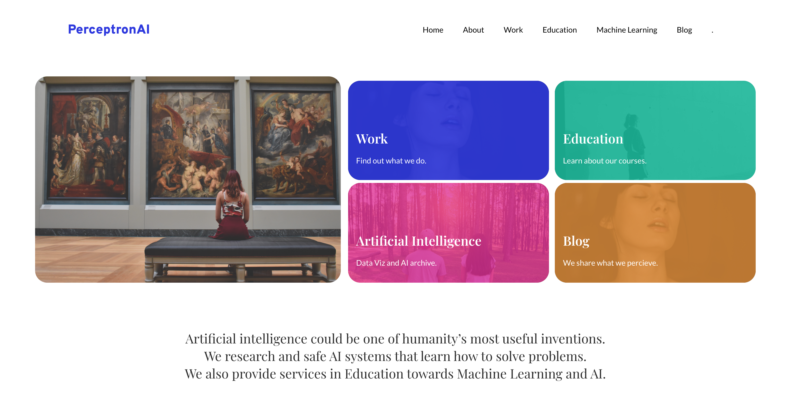
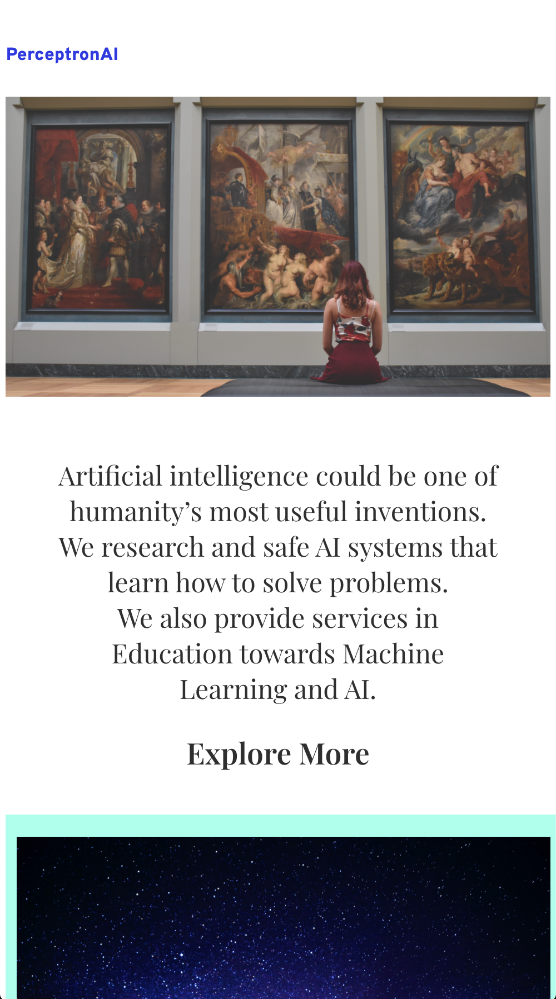
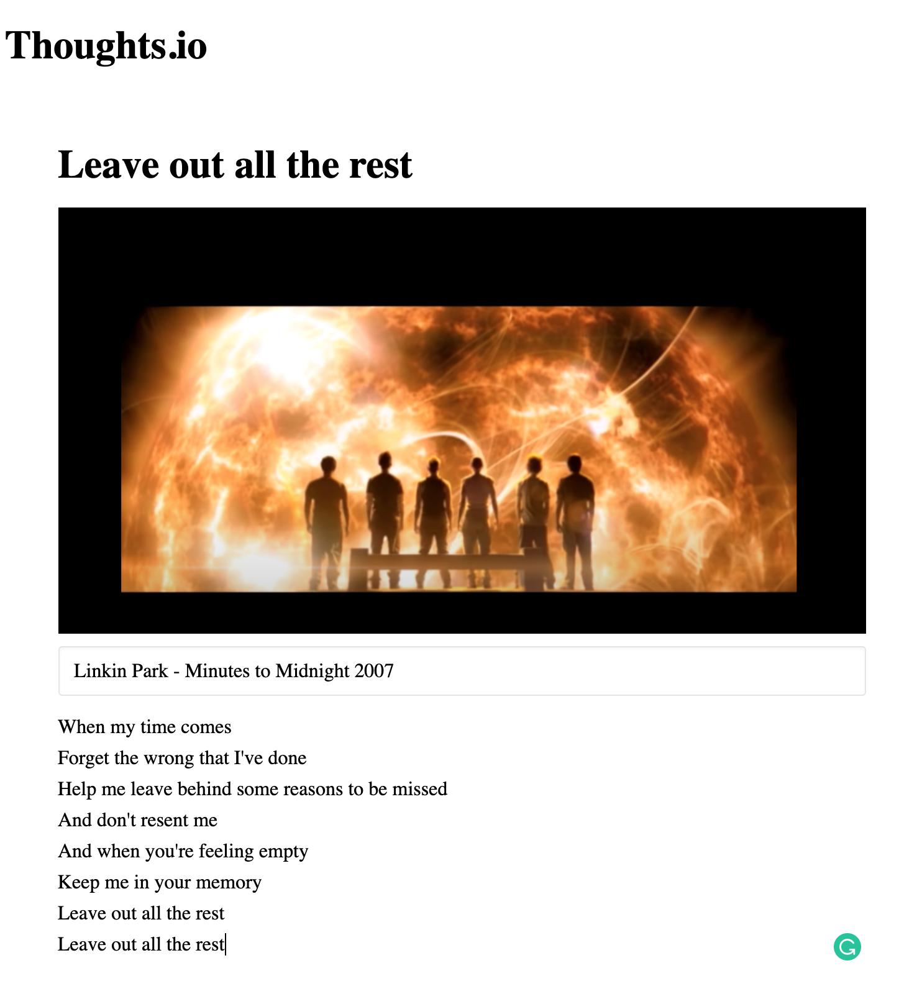

# Website Sample

>5th June 2020

# Mobile Sample

>7th June 2020

# Flask Integration
>8th June 2020

# Note Editor 
>10th June 2020
Thoughts.io [no-design]

# Router Handling
>11th June 2020

# No Productivity
>12th June 2020

# About Page 
>13th June 2020

Todo list for **Work Page**
- [ ] Two Machine Learning Models
  - [x] Text Classifier 
  - [ ] Image classification
- [ ] Two UI models
- [ ] Two Educational models
  - [ ] Random forest classification with d3.js
  - [ ] Principal Component Analysis

# BERT
>15th June 2020

# Text Classification with BERT
>17th June 2020
